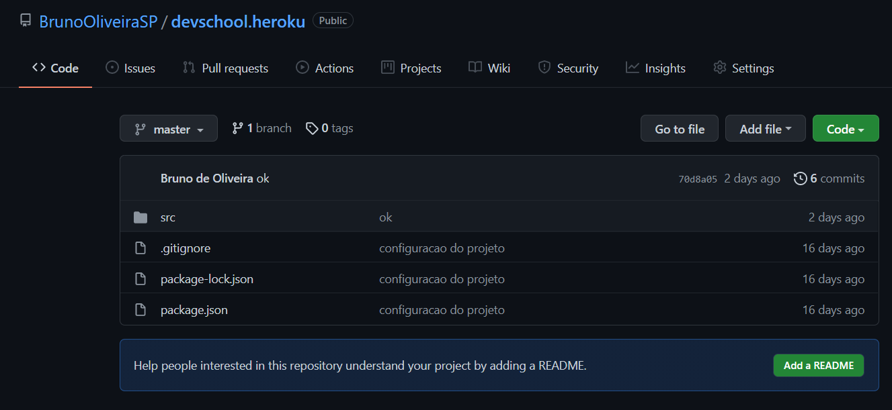

# |Como publicar o Backend na Internet?

## Heroku


### No Github
- Criar outro repositório para guardar apenas o projeto da API
- O nome do Repositório pode ser **NomeDoProjeto.Heroku**



### No VSCode
- Adicionar o repositório criado acima ao projeto
  - *CTRL + SHIFT + P*, depois Git Add Remote
  - Dê o nome do novo repositório de **Heroku**
- No Terminal, execute o comando:
  ```git subtree push --prefix **api** **heroku** master```

Isso irá subir o projeto **api** para o repositório **heroku**.

### Na Heroku
1. Criar uma **conta** na Heroku;
1. Criar um **projeto** na Heroku;
1. **Conectar** o projeto ao Github criado anteriormente;
1. Publicar (**Clicar em Deploy**).


>- Marque a opção **Enable Automatic Deploys** para que a Heroku publique automaticamente sua API quando um commit for feito no repositório vinculado.

>- Após publicado, o link da API pode ser encontrado clicando no botão **open app**.


### Próximas Atualizações

O processo acima deve ser feito apenas uma vez. Para publicar as novas alterações realizadas na API, somente é necessário atualizar o repositório da Heroku com o comando ```git subtree push --prefix **api** **heroku** master```.