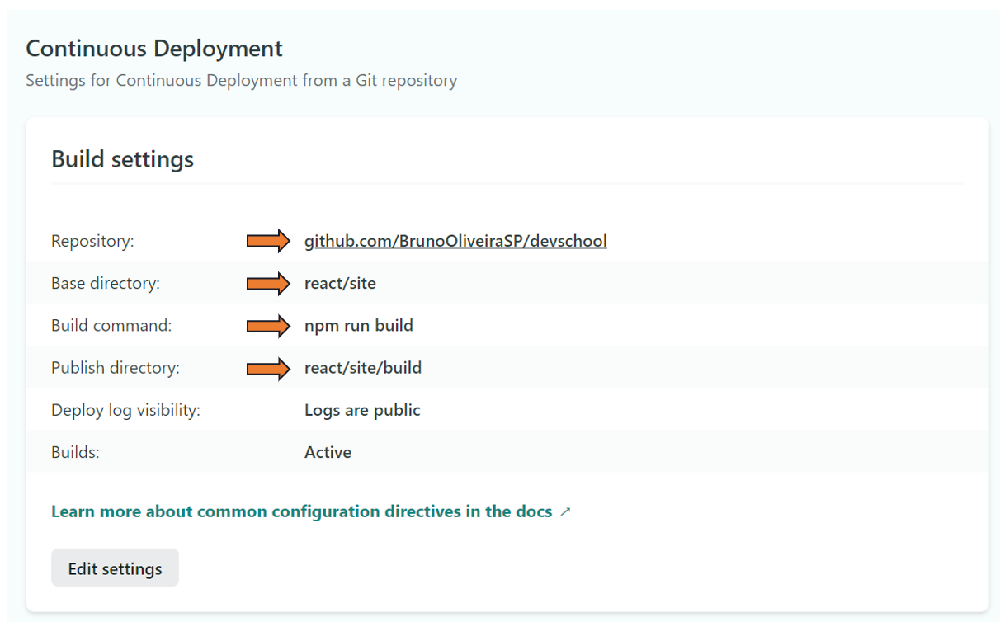

# |Como publicar o Frontend na Internet?

## Netlify

1. Criar uma **conta** na Netlify;
1. Criar um **projeto**;
1. **Vincular** o projeto ao Github;
1. No Menu **Build & Deploy**, configurar conforme abaixo:

##### Base Directory
Nome da pasta do seu **GITHUB** que contém seu projeto **REACT**. ex. react/site, react, etc.

##### Build Command
Comando para compilar o projeto em REACT e gerar os arquivos necessários para a publicação. Esse processo gerá uma pasta **build** onde terá os arquivos para serem hospedados.

##### Publish Directory
Nome da pasta que conterá os arquivos compilados para publicação. Ex. react/site/build 

### Próximas Atualizações

O processo acima deve ser feito apenas uma vez. Para publicar as novas alterações realizadas no REACT, somente é necessário realizar os comandos de **commit** e **push** para que o próprio Netlify realize a publicação **automaticamente**.

## NÃO SE ESQUEÇA

Você deve alterar seu arquivo no diretório **service** para apontar para a API publicada na Heroku. Depois é só fazer Commit e Push.

